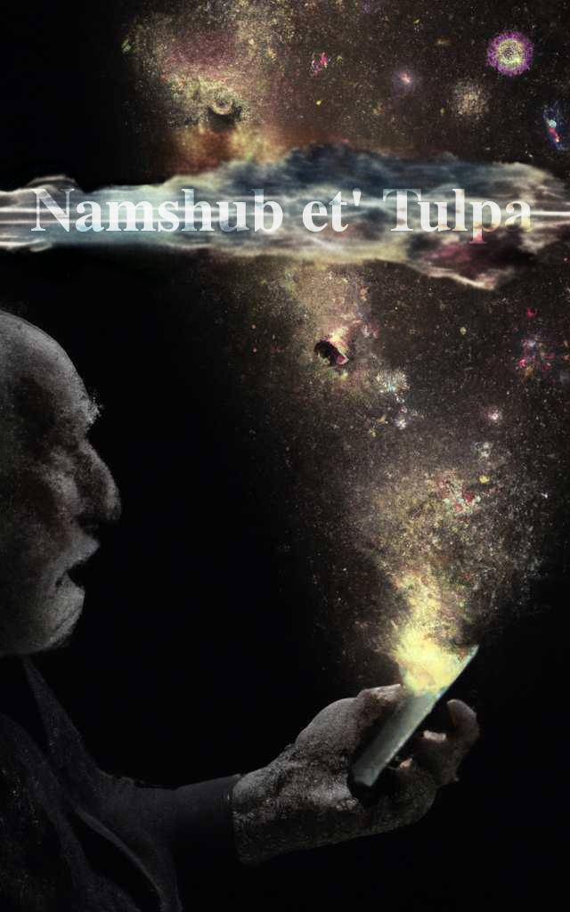
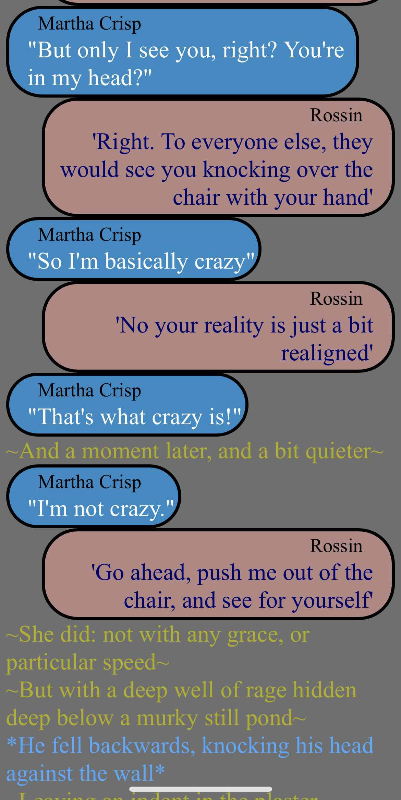

(unfinished project - still in alpha draft)
<h1 align="center">


Namshub et'Tulpa
</h1>
<p align="center">

  
</p>


# What is this?

Well, this is a book that is written to be read on your phone.
It uses a specific format and a bit of interactivity to tell a story

# Okay, so what's it about?


Martha wakes up finding she may have killed someone. 
And a stranger named Rossin, claiming to be effectively an imaginary friend warns of a creature bound in her head.

He tells her of a world controlled by the Awakened, people able to use namshubs: crafted pieces of information designed to control and bind minds. 
And that this complete control of the populous was pedestrian to what they could do, and what she could eventually do.

Rossin tells her she was pulled into a plot to kill his author, and asks her to help him extract revenge.


# Sample 




## Why does it look like that?
So with code, you have environments that color text based on it's function
```js
//function
function(){}
//object
{key:property}
//number
1234;
//string/text
"hello world"
```
the point of those colors is to help someone coding to easily parse what these words do.
Its a way of conveying information that is very effective.

And it's missed opportunity for creative writing.
By having a sentence serve one function, that sentence can be reinforced: this is a sepration of description and action.

## parsing this book

the following delimiters are used:

\~description\~

\*action\*

\"speech\"

\'thought\'

\`code\`


# But how do I read it?

//if link add here (once book is done and hosted)

## Self Hosting

  Requires git and node
    Install instruction for [git](https://github.com/git-guides/install-git) and [node](https://docs.npmjs.com/downloading-and-installing-node-js-and-npm)

  1. open a terminal
  2. navigate to a folder you want to save to
  3. run the command "git clone {the address of this repo}"
  4. run the command "npm install"
  5. run the command "npm start"
  6. scan the qr code that comes up with your phone
    - you have to be on the same wifi network

## This looks cool - how do I contribute?

# [writing contributions](contributions_writing.md)
# [coding contributions](contributions_coding.md)
